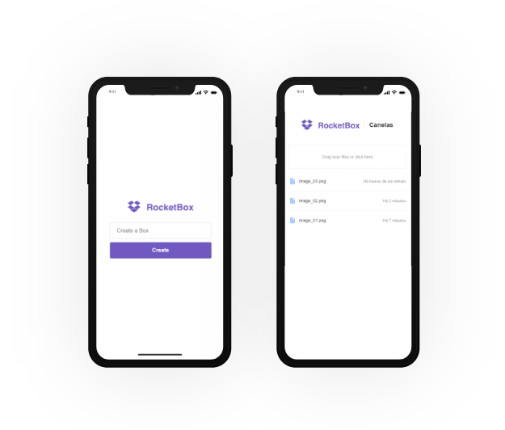

by [Rocketseat](https://rocketseat.com.br/week-6)

This was a free mini course during few days to present the main course offered by Rocketseat. The objective of the course it was to work with Node.js, React, React Native and MongoDB. The project developed, the RocketBox, is able to send files to the server (in this case locally) but connecting to a database remotely (using the MongoD Atlas). It also has been used socket tool to sync in run time the files of the boxes.



---

## 👉🏻 Getting Started

1 - Clone & Dependencies

Clone this repo and use `yarn` to install dependecies

```bash
yarn install
```

2 - Configuration

- Go to `packages/server` and renamed `.env.example` to `.env` and inform your database URI.
- Go to `packages/web` and renamed `.env.example` to `.env` and inform the url of the API.

3 - Start (server & web)

```bash
yarn dev
```

## 👉🏻 Others

If you are using MongoDB Atlas and running local, don't forget to add your IP in `cloud.mongodb.com > Security > IP Whitelist`.
